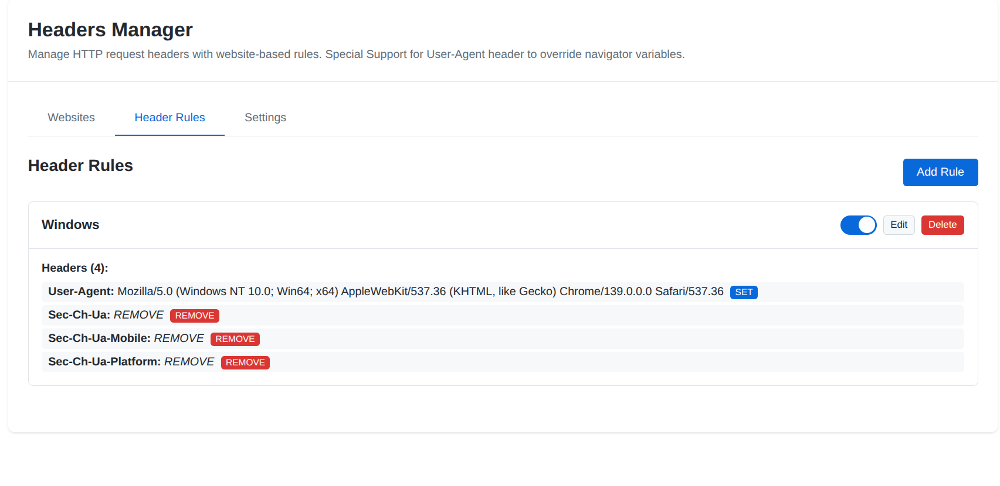
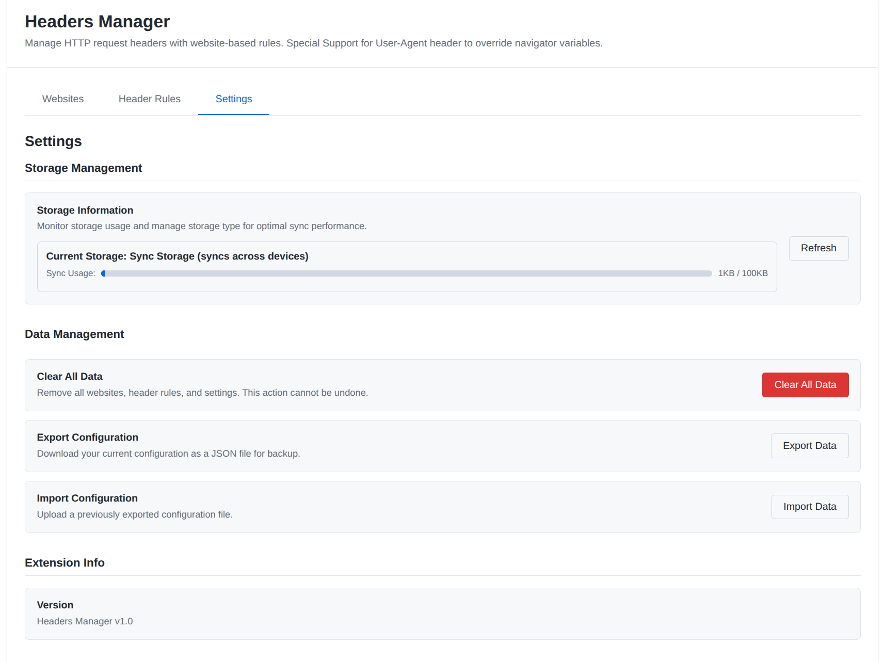
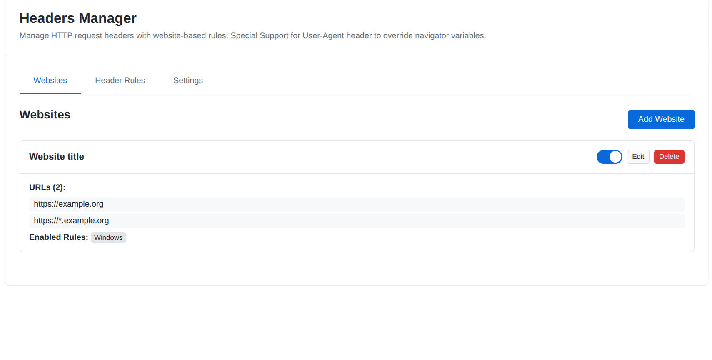

# Headers Manager

A Chrome extension for managing HTTP request headers with URL-based rules and grouping functionality.

## Features

- **Rule-based Header Management**: Create reusable header rules that can be applied to multiple websites
- **Website Grouping**: Organize websites and apply different header rule combinations to each group
- **URL Pattern Matching**: Support for various URL patterns including wildcards and subdomain matching
- **Navigator Property Override**: Override browser navigator properties like User-Agent, platform, and userAgentData
- **Real-time Toggle**: Enable/disable websites and individual rules through the popup interface
- **Persistent Storage**: Configuration synced across Chrome instances using Chrome Storage API
- **CORS Support**: Built-in CORS header templates for development
- **Privacy Features**: Remove tracking headers like Referer and X-Forwarded-For

## Installation

### From Source

1. Clone or download this repository
2. Open Chrome and navigate to `chrome://extensions/`
3. Enable "Developer mode" in the top right
4. Click "Load unpacked" and select the extension directory
5. The Headers Manager extension will be added to your browser

### From Chrome Web Store

*(Extension not yet published to Chrome Web Store)*

## Usage

### Quick Start

1. Click the Headers Manager icon in your browser toolbar
2. Click "Options" to open the configuration page
3. Add a website group and configure URL patterns
4. Create header rules or use the default templates
5. Enable the rules you want to apply to each website
6. Toggle websites on/off from the popup

### Creating Header Rules

Header rules are reusable templates that define which headers to modify:

1. Go to the "Header Rules" tab in Options
2. Click "Add Rule" to create a new rule
3. Configure headers with:
   - **Name**: The HTTP header name (e.g., `Authorization`, `User-Agent`)
   - **Value**: The header value to set
   - **Operation**: 
     - `set` - Add or replace the header
     - `remove` - Remove the header from requests

#### Default Rules

The extension comes with several pre-configured rules:

- **Basic CORS Headers**: Essential CORS headers for development
- **Bearer Token Auth**: Authorization header with Bearer token
- **Custom User Agent**: Override the browser's User-Agent
- **Privacy Headers**: Remove tracking headers

### Configuring Websites

Website groups allow you to apply different header rules to different URLs:

1. Go to the "Websites" tab in Options
2. Click "Add Website" to create a new group
3. Configure:
   - **Name**: A descriptive name for the website group
   - **URLs**: URL patterns to match (supports wildcards)
   - **Enabled Rules**: Select which header rules to apply

#### URL Pattern Examples

- `https://api.example.com/*` - Matches all paths under api.example.com
- `https://*.example.com/*` - Matches all subdomains of example.com
- `http://localhost:*/*` - Matches localhost on any port
- `https://example.com/api/*` - Matches only the /api/ path and subpaths

### Managing from Popup

The browser popup provides quick access to toggle functionality:

- **Website Toggle**: Enable/disable entire website groups
- **Rule Counter**: Shows active rules and total headers per website
- **Quick Access**: No need to open the full options page for simple toggles

### Storage Management

The Settings tab provides comprehensive storage management:

- **Storage Information**: Monitor current storage type and usage
- **Usage Visualization**: Progress bar showing sync storage consumption
- **Migration Controls**: Manually switch between sync and local storage
- **Recommendations**: Intelligent suggestions for optimal storage usage
- **Cross-device Status**: Clear indication of sync capabilities

## Technical Details

### Architecture

The extension uses Chrome's Manifest V3 architecture with:

- **Service Worker** (`background.js`): Manages header rules using declarativeNetRequest API
- **Storage Manager** (`storage-manager.js`): Intelligent hybrid storage system with automatic fallback
- **Content Scripts** (`inject/`): Override navigator properties in web pages
- **Popup Interface** (`popup.html/js`): Quick toggle controls
- **Options Page** (`options.html/js`): Full configuration interface

### Permissions

Required Chrome permissions:

- `declarativeNetRequest`: Modify HTTP headers
- `storage`: Save configuration data
- `activeTab`: Access current tab for navigator overrides
- `scripting`: Inject content scripts
- `<all_urls>`: Apply headers to any website

### Storage

The extension uses an intelligent hybrid storage system that automatically manages data between Chrome's sync and local storage:

#### Automatic Storage Management
- **Sync Storage**: Used by default for cross-device synchronization (100KB limit)
- **Local Storage**: Automatically used when data exceeds sync limits (unlimited)
- **Smart Migration**: Seamlessly switches between storage types based on data size
- **Backup Protection**: Prevents data loss during storage transitions

#### Storage Features
- **Real-time Monitoring**: Track storage usage in the Settings tab
- **Manual Migration**: Force migration between storage types when needed
- **Cross-device Sync**: Settings sync automatically when using sync storage
- **Large Configuration Support**: No practical limit on number of rules/websites

#### Storage Behavior
- Data under 80KB: Stored in sync storage for cross-device access
- Data over 80KB: Automatically migrated to local storage
- Manual migration available in Settings → Storage Management
- Existing data preserved during all migrations

### Content Script Injection

The extension injects three content scripts in a specific order:

1. **main.js**: Sets up communication port in MAIN world
2. **override.js**: Performs navigator property overrides in MAIN world  
3. **isolated.js**: Coordinates overrides from ISOLATED world

This architecture ensures navigator overrides work correctly while maintaining security isolation.

## Use Cases

### Web Development

- **CORS Testing**: Add CORS headers to local development servers
- **API Authentication**: Test APIs with different authentication tokens
- **User Agent Testing**: Test responsive designs with different user agents

### Privacy & Security

- **Header Removal**: Remove tracking headers like Referer
- **Browser Fingerprinting**: Modify navigator properties to reduce fingerprinting
- **Custom Headers**: Add security headers for testing

### Testing & QA

- **Environment Switching**: Different headers for dev/staging/prod environments
- **A/B Testing**: Test with different header configurations
- **Browser Simulation**: Simulate different browsers and devices

## Limitations

- **Chrome Only**: Built specifically for Chrome/Chromium browsers
- **HTTP/HTTPS Only**: Cannot modify headers for other protocols
- **Cross-device Sync**: Limited to 100KB when using sync storage (larger configs use local storage only)
- **Declarative Rules**: Header modifications are declarative, not programmatic

## Troubleshooting

### Headers Not Applied

1. Check if the website is enabled in the popup
2. Verify URL patterns match the target website
3. Ensure header rules are enabled
4. Check Chrome DevTools Network tab to verify headers

### Navigator Overrides Not Working

1. Refresh the page after changing settings
2. Check browser console for error messages
3. Verify content scripts are loading correctly

### Configuration Not Saving

1. Check Chrome sync settings
2. Verify storage quota is not exceeded
3. Try disabling and re-enabling the extension

## Contributing

1. Fork the repository
2. Create a feature branch
3. Make changes and test thoroughly
4. Submit a pull request with detailed description

## License

This project is licensed under the MIT License - see the LICENSE file for details.

## Privacy Policy

This extension:
- Only modifies HTTP headers as configured by the user
- Does not collect or transmit any personal data
- Stores configuration locally in Chrome storage
- Does not communicate with external servers

## Screenshots

Below are some screenshots of the Headers Manager extension in action:

   
    <em>Header Rules: Manage and create reusable header templates</em>

   
    <em>Settings: Storage management and usage visualization</em>

   
    <em>Website Groups: Apply rules to different websites and groups</em>

## Support

For issues, feature requests, or questions:
- Create an issue on the GitHub repository
- Include browser version, extension version, and detailed steps to reproduce any problems